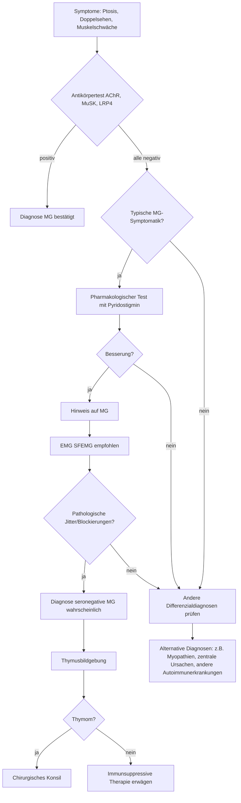

# Diagnose-Stellung MG

```mermaid
graph TD
  A[Symptome: Ptosis, Doppelsehen, Muskelschwäche] --> B{Antikörpertest AChR, MuSK, LRP4}
  B -->|positiv| C[Diagnose MG bestätigt]
  B -->|alle negativ| D{Typische MG-Symptomatik?}
  D -->|ja| E[Pharmakologischer Test mit Pyridostigmin]
  D -->|nein| Z[Andere Differenzialdiagnosen prüfen]
  E --> F{Besserung?}
  F -->|ja| G[Hinweis auf MG]
  F -->|nein| Z
  G --> H[EMG SFEMG empfohlen]
  H --> I{Pathologische Jitter/Blockierungen?}
  I -->|ja| J[Diagnose seronegative MG wahrscheinlich]
  I -->|nein| Z
  J --> K[Thymusbildgebung]
  K --> L{Thymom?}
  L -->|ja| M[Chirurgisches Konsil]
  L -->|nein| N[Immunsuppressive Therapie erwägen]
  Z --> O[Alternative Diagnosen: z.B. Myopathien, zentrale Ursachen, andere Autoimmunerkrankungen]
```
